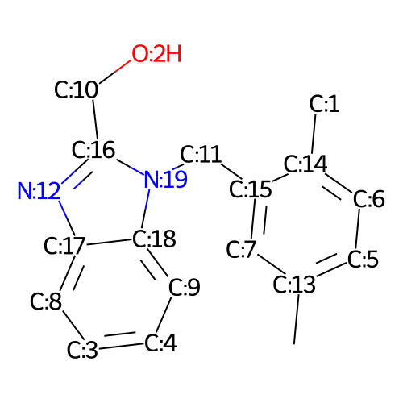
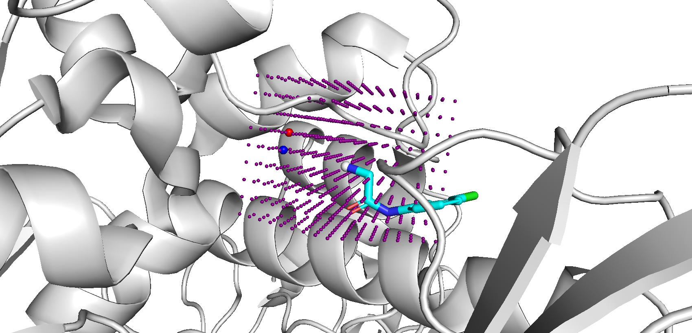

# STRIFE (STRucture Informed Fragment Elaboration)

This repository contains our implementation of the STRIFE algorithm, described in this [biorxiv preprint](https://www.biorxiv.org/content/10.1101/2021.10.21.465268v1).

STRIFE can be used either as a command line tool (running ```python STRIFE.py <arguments>``` in the terminal) or run via one of the provided jupyter notebooks (```STRIFE_notebook.ipynb``` or ```STRIFE_custom_notebook.ipynb```). See the below instructions for guidance on how to install and use STRIFE.

Contents of this README:
* Acknowledgements
* Requirements
* Installation
  * Downloading the CSD Python API
  * Downloading GHECOM
  * Setting up the STRIFE conda environment 
  * Installing the Hotspots API
  * Setting Environment Variables
* Running STRIFE
  * Example code to run STRIFE using the default implementation
  * Using PyMol
  * Calculating a Fragment Hotspot Map
  * Specifying a fragment exit vector
  * Manually specifying pharmacophoric points
* STRIFE output
* Contact

# Acknowledgements

The generative models in this work were based on the [Constrained Graph Variational Autoencoder](https://arxiv.org/abs/1805.09076). We thank the authors for releasing the [code](https://github.com/Microsoft/constrained-graph-variational-autoencoder) and invite you to cite their work if you found it useful. 

STRIFE calculates Fragment Hotspot Maps using the [Hotspots API](https://github.com/prcurran/hotspots) developed by [Curran et al.](https://pubs.acs.org/doi/10.1021/acs.jcim.9b00996). We thank the authors for making this resource available.


# Requirements

This code was tested in Python 3.7, using Tensorflow 1.15. A yaml file containing all required libraries is provided. Please see 'Installation' below for more information.

Use of the Hotspots API (extraction of target-specific information) and the GOLD API (constrained docking) requires the commercial CSD Python API,  maintained by the [Cambridge Crystallographic Data Centre](https://www.ccdc.cam.ac.uk/) (CCDC). If you do not have a CSD licence, STRIFE allows you to easily specify your own pharmacophoric points (see below) but you will need to provide your own function for docking and scoring the generated molecules.


# Installation

## Downloading the CSD Python API

To download the CSD suite you need to know your institution's Activation Key and Licence Number. Go to the [CSD Downloads page](https://www.ccdc.cam.ac.uk/support-and-resources/csdsdownloads/) and fill in the information to receive an email (titled 'CCDC Download Request') with a set of download links. Copy the relevant link (for linux users 'CSDS 2021.2 Linux' or similar).

As the download link includes special characters, it is necessary to enclose the url with single quotation marks:

```
wget '<insert download link here>'
```

If successful, your current directory will now contain a tar file, which can be unzipped using the `tar -xvf <tar_file>` functionality.

This should yield a directory named `csds-2021.2.0-linux-installer` (or similar, depending on the exact version). You can run the installer by entering `csds-2021.2.0-linux-installer/csds-linux-x64.run` in the command line. If you don't have access to a GUI, you should add the `--mode text` flag.

Hopefully, after this stage you should have access to the CSD suite!


## Downloading GHECOM

The Hotspots API uses GHECOM for buriedness calculations. It can be downloaded [here](https://pdbj.org/ghecom/download_src.html). After providing some basic contact information, you will be provided with a link to download the source code (at time of writing labelled `ghecom-src-20200721.tar.gz`). To install GHECOM, download the link and run the following commands:

```
tar -zxvf ghecom-src-[date].tar.gz
cd src
make
```

If successful, an executable file called `ghecom` will now be in the parent directory.


## Setting up the STRIFE conda environment

This can be done by simply using the provided `STRIFE_environment.yml` file. You will need to edit the yml file in two places: First, the CCDC installer creates a directory named `Python_API_2021/ccdc_conda_channel/`. You will need to update the yml file to provide the location of this directory. Second you will need to update the prefix at the bottom of the file to where you have installed the CSD Suite.

Once the yml has been updated, simply run:

```
conda env create -f STRIFE_environment.yml
conda activate STRIFE
```

## Installing the Hotspots API

We found that there were compatibility issues with the conda/pip version of the Hotspots API and the most recent version of GHECOM. This can be gotten around by installing the latest version of the Hotspots API as follows:

```
mkdir ./hotspots_code
cd hotspots_code

git clone git@github.com:prcurran/hotspots.git
conda activate STRIFE
pip install ./hotspots

```

This should then allow you to calculate Fragment Hotspot Maps (see below for more information).


## Setting Environment Variables

You will need to specify a handful of environment variables:

```
#Recommended - make these variables permanent by including in your .bashrc file
export CSDHOME=<path/to/CSD/installation>/CSD_2021 #Lets python see where the CSD installation is
export GHECOM_EXE=<path/to/ghecom/executable>/ghecom #Lets python know where the ghecom executable is for the buriedness calculations in the hotspots algorithm
export GOLD_DIR=<path/to/CSD/installation>/Discovery_2021/GOLD #To do GOLD docking in the Python API
```

After this step you should be able to run STRIFE from the terminal!


# Running STRIFE

STRIFE can be run from the command line by typing 

```
python STRIFE.py <arguments>
```

For information about the different arguments which can be used, run `python STRIFE.py -h` or open the ```parse_args.py``` file.

STRIFE has two required arguments, which must be passed to the model:

* `--fragment_sdf` Location of the fragment SDF. Can be an SDF file of a larger ligand for which the fragment is a substructure (in case the user only has a structure of a larger molecule but wishes to replace an R-group.
* `--protein` Location of a protein pdb file (should already have been protonated to allow docking in GOLD)

In addition, the user must provide information regarding which atom should be used as an exit vector. This can be done using one of the following arguments:
* `--fragment_smiles`: Either a SMILES string or the location of file which contains fragment SMILES string. Exit vector should be denoted by a dummy atom. Or
* `--exit_vector_idx`: An integer corresponding to the atom index of the desired exit vector.

`--fragment_smiles` offers a slightly greater degree of flexibility than `--exit_vector_index`, as the user can provide the SMILES string of a molecule which is a substructure of the molecule provided in `--fragment_sdf` and STRIFE will make elaborations to that substructure. This can be useful if the user wanted to explore alternatives to a specific R-group.


There are a variety of extra arguments which can be provided to the model, the most important of which is `--model_type`, which allows the user to choose which setting to run STRIFE on:
* `0` runs the default implementation of STRIFE outlined in the paper
* `1` allows the user to manually specify their own pharmacophoric points (instead of STRIFE extracting them from a Fragment Hotspot Map). STRIFE will attempt to generate elaborations which simulataneously satisfy all pharmacophoric points. See below for instructions on how to do this.
* `2` runs the STRIFE_NR outlined in the paper, where the Refinement phase of the STRIFE algorithm is omitted.


### Example code to run STRIFE using the default implementation

We run STRIFE on one of the examples in our test set derived from CASF-2016 (PDB ID 1Q8T). The ground truth ligand (`examples/1q8t_ligand.sdf`) was fragmented to yield a fragment for elaboration. We have already calculated the FHM (`example/hotspotsOut/out.zip`), so STRIFE doesn't need to calculate it before commencing.

```
python STRIFE.py -f example/1q8t_frag.sdf -s example/1q8t_frag_smiles.smi -p example/1q8t_protein.pdb -z example/hotspotsOut/out.zip -o example/STRIFE_1q8t
```

# Using PyMol

We found that installing PyMol into the STRIFE directory seemed to cause issues. Others might not find this to be the case but for simplicity we provide a second Conda environment, called `pymol_env` which just contains the packages necessary to run the open source version of PyMol. The environment can be installed as follows:

```
conda env create -f PyMol_environment.yml
conda activate pymol_env
```

And a PyMol session can be started by simply running `pymol` in the command line. 


# Calculating a Fragment Hotspots Map

We provide a simple script to calculate an FHM for a given PDB file. Simply run:

```
cd <path/to/STRIFE/directory>
conda activate STRIFE
python run_hotspots_algorithm.py <location of PDB File> <Output Directory>
```
To view the FHM, run:

```
conda activate pymol_env
cd <Output Directory>
python pymol_file.py
```

Which will load a PyMol session with the FHM displayed

# Specifying a fragment exit vector

STRIFE requires the user to pick an atom in the fragment to be used as an exit vector - all elaborations will be attached to the specified atom. When inputting the fragment SMILES, STRIFE requires the exit vector to be bonded to a dummy atom. To facilitate this, we provide a short script which writes an image of the molecule (example below) where each atom is numbered with its index. The user can then provide their desired atom index as an input to STRIFE or request that the script returns a SMILES string that can be provided to STRIFE.

To generate an image of the fragment with atomic indices, simply run:

```
cd data_prep
python specifyExitVector.py -f <fragment_SDF> -o <location_to_save_image> 
```

To generate a SMILES string that can be directly provided to STRIFE, include the `-r` (`--return_smiles_string`) flag:

```
cd data_prep
python specifyExitVector.py -f <fragment_SDF> -o <location_to_save_image> -r
```

Inspect the image and follow the instruction to provide an atom index as `input()`. The resulting SMILES string will be printed to the console, and written to file if requested.

An example of a numbered molecule is below (the unnumbered atom has index 0):




# Manually Specifying Pharmacophoric Points

To manually specify a set of pharmacophoric points, you should use the `doManualPharmSpecification.sh` bash script, which should be run as follows:

```
bash doManualPharmSpecification.sh <fragment_SDF> <fragment_SMILES> <protein_PDB> <directory_to_store_output>
```

The script loads the fragment into a PyMol session and generates a lattice of points about the exit vector. The user then selects their desired pharmacophoric points and can save them in the output directory. The donor hotspots and the acceptor hotspots must be saved in separate SDF files and must be called `donorHotspot.sdf` and `acceptorHotspot.sdf`. When running STRIFE, specify `--model_type 1` and `--output_directory <directory_to_store_output>` so that STRIFE knows to use the manually specified hotspots and where to find them.



Once the pharmacophoric points have been manually specified, you can generate elaborations with STRIFE using (for example):

```
conda activate STRIFE
python STRIFE.py -f example_custom_pharms/1q8t_frag.sdf -s example_custom_pharms/1q8t_frag_smiles.smi -p example_custom_pharms/1q8t_protein.pdb -o <directory_to_store_output> --load_specified_pharms --model_type 1
```

# STRIFE output

The primary output provided by STRIFE is a pandas dataframe containing the final SMILES strings generated by STRIFE and their associated ligand efficiency score. This is stored as an attribute of the STRIFE class and is called `rankedElaborationsFinal`. You can use the `--write_elaborations_dataset` to save this dataframe as a csv in the `--output_directory`.

In addition, we also save the docked molecules in an SDF file in the `--output_directory`, with the ligand efficiency score saved as an attribute of each molecule. If `--model_type` is set as `0`, the SDF file is called `pharmsElabsTestDocked.sdf`. If `--model_type` is set as `1`, the SDF file is called `pharmsElabsTestMultiDocked.sdf`.


# Contact (Questions/Bugs/Requests)

Please contact Tom Hadfield, at hadfield@stats.ox.ac.uk
